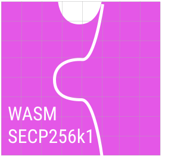

# wasm-secp256k1

## WORK IN PROGRESS!

This repository generates portable [Web Assembly](https://webassembly.org/) (WASM) files that contain various cryptographic operations on the secp256k1 curve.

**These include:**
1. Signature generation
2. Signature validation
3. Private key generation


### About 

Two submodules [libsecp256k1](https://github.com/bitcoin-core/secp256k1) and [WASI-libc](https://github.com/WebAssembly/wasi-libc) are used along with the LLVM tool chain to produce stand alone wasm files that may be ported to many different environments.


It is currently being employed in an [isomorphic JS](https://en.wikipedia.org/wiki/Isomorphic_JavaScript) environment for [ReLocke/SmartQL-signature](https://github.com/relocke/SmartQL-Signature).


Read more about wasi [here](https://hacks.mozilla.org/2019/03/standardizing-wasi-a-webassembly-system-interface/).

## MacOS setup homebrew edition

0. clone repo with submodules
```shell
git clone --recursive https://github.com/relocke/wasm-secp256k1.git
```

1. Install LLVM
```shell
brew install llvm
```
2. Activate instillation with
```shell  
export PATH=/usr/local/opt/llvm/bin:$PATH 
```
3. check you have wasm32
```shell
llc --version
```


4. run build script
```shell
source build.sh
```

5. build wasm
```shell
source build_wasm.sh
```
--- 

## About .lib

#### GMP
Contains header files and libraries for [GMP](https://gmplib.org/)

#### wasi/libclang_rt.builtins-wasm32

Can be built from [wasi-sdk](https://github.com/WebAssembly/wasi-sdk) or download the directly from [here](https://github.com/WebAssembly/wasi-sdk/releases).


## Troubleshooting

### Missing libclang_rt.builtins-wasm32.a


To resolve this issue, you need to add `libclang_rt.builtins.a` library to the llvm path specified by the error.
Add the library `wasi/libclang_rt.builtins.a` into the path specified by your compiler.


### libsecp256k1-config.h modifications


If you get an error like in the above image, you can try and update the `libsecp256k1-config.h` file located in `.submodules/secp256k1/src/libsecp256k1-config.h` to a different configuration. 